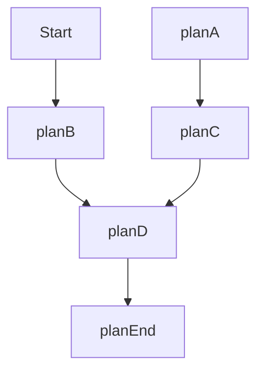

## Typora的快捷键使用

> 注意：有些快捷键需要在设置-->偏好设置中，按照个人习惯，进行设置


`Ctrl + 1 `一级标题；

`Ctrl + 2  `二级标题；

`Ctrl + 3`三级标题；

`Ctrl + 4`四级标题；

`Ctrl + 5`五级标题

`Ctrl + 6`六级标题


#### `Ctrl + B`文本加粗；****

**我的markdown**（普通文本加粗）

> 注意：
>
> 普通文本加粗和五级标大小一样；
>
> 六级标题大小和五级标题一样，但是颜色为浅灰色；


#### `Ctrl + shift + 5`删除线；

不要~~998~~，不要~~996~~，只需~~98~~，轻松带回家


#### `Ctrl+ I`文本下斜体；**

*我的markdown*


#### `Ctrl + U`文本划线；<u></u>

<u>我的Markdown</u>


#### `***`加粗分割线

****

#### `---`分割线

---


#### `Ctrl + K`超链接；

[哔哩哔哩](www.bilibili.com)

文章内的锚链接（#+想要到跳转到的标题）

点击时按住`Ctrl`进行点击

[一级标题](#我的Markdown)


#### `Ctrl + T`表格

| 学号  | 姓名 | 班级 |
| :---: | :--: | :--: |
| 10001 | 阿大 | 三班 |
| 10002 | 阿二 | 二班 |
| 10003 | 阿三 | 一班 |


#### `Ctrl + shift + Q`引用

引用中可以再插入引用（使用‘ < ’）

> “可惜我迟生了二十年。倘若妈妈[^]先生我，再生妹妹，我学会了师父的龙象般若功和无上瑜珈密乘，在全真教道观外住了下来，自称大龙女，小杨过在全真教中受师父欺侮，逃到我家里，我收留了他教他武功，他慢慢的自会跟我好了。他再遇到小龙女，最多不过拉住她手，给她三枚金针，说道：
>
> >『小妹子，你很可爱，我心里也挺喜欢你。不过我的心已属大龙女了。请你莫怪！你有甚么事，拿一枚金针来，我一定给你办到。』”


#### `Ctrl + shift + I`图片插入


手动输入格式：``


支持本地图片

 

支持网络图片


#### `Ctrl + shift + ~`行内代码块；

`<!DOCTYPE html>`

`<html lang="en"></html>`


#### `~~~~ + Enter`整个代码块嵌入

```HTML
<!DOCTYPE html>
<html lang="en">
<head>
<meta charset="UTF-8">
<title>Father</title>
</head>
<body>
<h1>我还是你baba！</h1>
</body>
</html>
```


#### `emoji` 图标：

先输入`:`然后输入相应`emoji`的名称，（注意）英语输入法

:arrow_double_up:

:beach_umbrella:

:upside_down_face:

:man_scientist:

:school:


#### `====`文本的高亮显示

> 阿朱嫣然一笑，道：“这样罢，我算是给你掳来的奴仆，你高兴时向我笑笑，你不开心时便打我骂我，好不好呢？
>
> ==”乔峰微笑道：“我一拳打下来，只怕登时便将你打死了。”==


#### `<！---->`注释（导出图片不会显示）

`<！--这一段不要显示出来-->`


#### `Mermaid`流程图




#### `Sequence`时序图

```sequence
Alice->>John: Hello John, how are you?
Note right of John: Rational thoughts
John->>Alice: Great! I am fine.
John->>Bob: How are you?
Bob->>John: All right!
```


#### `[toc]`生成目录

[TOC]